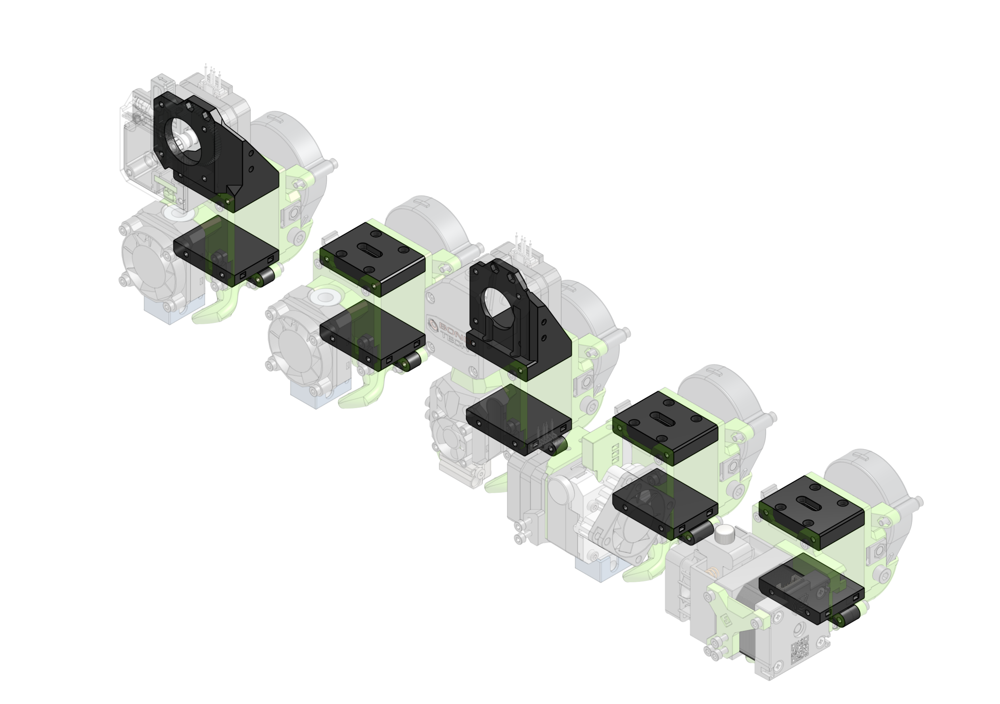

In short, **yes**. One can use EVA 2 on a MGN15C carriage.

While EVA 2 will focus on MGN12 rails (since those are supposed to be ~50% lighter) there still is a posibility to use an EVA 2, with the help of the **top** and **bottom** parts you can find in this addon.

### Links

{{ eva_download_button("mgn15") }}

{{ eva_link("mgn15") }}

{{ onshape_link("mgn15") }}

### BOM

=== "Titan"

{{ bom("addons/mgn15/bom/titan.csv", 4) }}

=== "Generic"

{{ bom("addons/mgn15/bom/generic.csv", 4) }}

=== "BMG"

{{ bom("addons/mgn15/bom/bmg.csv", 4) }}
